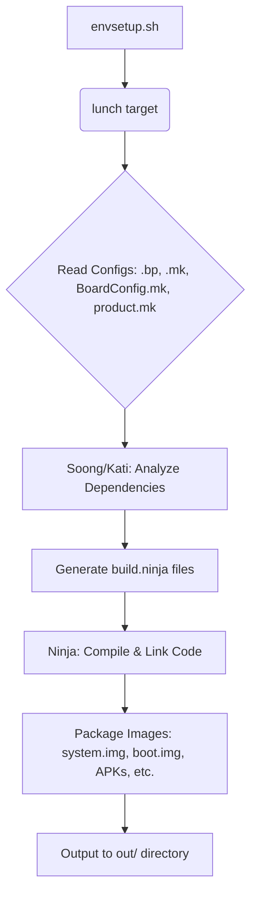

# Part 3: AOSP Build System Deep Dive

This section delves into the intricacies of the Android Open Source Project (AOSP) build system. Understanding its structure, components, and workflow is essential for anyone looking to customize Android, add new features, or develop hardware-specific implementations.

## 🧱 Step 1: Understand AOSP Build Structure

The AOSP build system has evolved over time. Initially, it was heavily reliant on **GNU Make** (using `Android.mk` files). However, to address scalability, performance, and maintainability, Google introduced **Soong**, a build system that uses **Blueprint** files (`Android.bp`). While `Android.mk` is still supported for legacy modules and certain use cases (like NDK builds), `Android.bp` is the modern standard for most AOSP development.

*   **Soong**: A build system written in Go that interprets `Android.bp` files. It generates Ninja build files, which are then executed to perform the actual compilation and linking.
*   **Blueprint**: A declarative, JSON-like syntax used in `Android.bp` files to define modules and their dependencies. It aims to be simpler and less error-prone than Makefiles.
*   **Kati**: A tool used to convert existing `Android.mk` files into Ninja files, allowing the build system to process both `Android.mk` and `Android.bp` files.

### 🔹 Key Directories in AOSP Tree

The AOSP source tree is organized into several key directories, each serving a specific purpose. Familiarity with this structure is crucial for locating code, configurations, and build files.

| Directory        | Purpose                                                                 |
| :--------------- | :---------------------------------------------------------------------- |
| `build/`         | Contains the core build system scripts, tools (like Soong, Kati), and global build definitions. |
| `device/`        | Holds device-specific configurations, including board configurations (`BoardConfig.mk`), product definitions (`device.mk`, `AndroidProducts.mk`), and vendor-specific files for particular hardware (e.g., `device/google/pixel/`). |
| `vendor/`        | Contains proprietary binary blobs (drivers, HALs) and applications provided by hardware vendors or third parties. This is also a common place for OEMs to add their customizations. |
| `frameworks/`    | The heart of the Android framework. Includes `frameworks/base` (core Android services, APIs, system UI), `frameworks/native` (native libraries and services), and `frameworks/av` (multimedia framework). |
| `packages/apps/` | Contains AOSP's stock applications like Dialer, Contacts, Settings, Launcher, etc. This is where you'd typically add new system applications. |
| `system/`        | Core system components, including system services, native daemons, core libraries, and the init system (`system/core/init/`). |
| `kernel/`        | Contains the Linux kernel source code. This might be a specific kernel version or a placeholder if the kernel is built separately. |
| `hardware/`      | Home to Hardware Abstraction Layers (HALs). HALs provide a standardized interface between the Android framework and device-specific hardware drivers. Examples include `hardware/libhardware` (legacy HALs) and `hardware/interfaces` (HIDL/AIDL HALs). |
| `bootable/`      | Code related to the bootloader, recovery system, and disk utilities (e.g., `bootable/recovery/`). |
| `external/`      | Contains external open-source libraries and tools used by Android, such as SQLite, OpenSSL, WebKit (via Chromium), Clang/LLVM, etc. |
| `art/`           | The Android Runtime (ART), responsible for executing Android applications. |
| `dalvik/`        | Legacy Dalvik Virtual Machine code (largely replaced by ART). |
| `prebuilts/`     | Contains pre-compiled tools and libraries used during the build process or for development, such as the Android SDK, NDK, and various compilers. |
| `out/`           | The output directory where all compiled files, images (`system.img`, `boot.img`, etc.), and intermediate build artifacts are placed. This directory is created during the build process. |

### 🔹 Build System Components

The AOSP build system relies on several key configuration files to define modules, products, and hardware-specific settings.

#### 🟨 `Android.mk` (Legacy)

*   **Purpose**: Used with the traditional GNU Make-based build system. Defines how to build a module (e.g., an app, library, or executable).
*   **Syntax**: Imperative, Make-based syntax.
*   **Usage**: Still supported, especially for native C/C++ components, NDK builds, and sometimes for prebuilt modules due to its familiarity.
*   **Example**:

    ```make
    LOCAL_PATH := $(call my-dir)
    include $(CLEAR_VARS)

    LOCAL_MODULE := MyLegacyApp
    LOCAL_SRC_FILES := src/com/example/MyLegacyApp.java
    LOCAL_MODULE_TAGS := optional
    # For Java applications
    include $(BUILD_PACKAGE)

    # For C/C++ shared libraries
    # LOCAL_MODULE := libmylegacylib
    # LOCAL_SRC_FILES := mylegacylib.c
    # include $(BUILD_SHARED_LIBRARY)
    ```

#### 🟦 `Android.bp` (Blueprint files)

*   **Purpose**: The modern way to define modules for the Soong build system. Replaces `Android.mk` for most new development.
*   **Syntax**: Declarative, JSON-like syntax. Designed to be simpler and less error-prone than Makefiles.
*   **Usage**: Preferred for all new Java, C++, and Go modules in AOSP.
*   **Example** (for an Android app):

    ```bp
    android_app {
        name: "MyModernApp",
        srcs: ["src/**/*.java"],
        manifest: "AndroidManifest.xml",
        sdk_version: "current",
        // For system apps, you might add:
        // privileged: true,
        // certificate: "platform",
        // system_ext_specific: true, // if it belongs in the system_ext partition
    }
    ```

#### 🛠️ `device.mk` / `product.mk`

*   **Purpose**: These Makefiles define a specific product variant. They specify which modules (apps, libraries, services, etc.) are included in the build for that product, set product-specific properties, and define other characteristics like screen density or supported locales.
*   **Location**: Typically found in `device/<vendor>/<device_name>/` (e.g., `device/google/pixel/aosp_oriole.mk`) or `vendor/<vendor_name>/products/`.
*   **Key Variable**: `PRODUCT_PACKAGES` is used to list all modules to be included in the system image. Example: `PRODUCT_PACKAGES += MyModernApp MyLegacyApp libmylib`.

#### 📃 `BoardConfig.mk`

*   **Purpose**: Contains hardware-specific configurations for a particular board or device. This includes settings for the CPU architecture, kernel configuration, partition layout, bootloader parameters, and flags for HALs.
*   **Location**: Typically `device/<vendor>/<device_name>/BoardConfig.mk`.
*   **Example Variables**: `TARGET_ARCH`, `TARGET_CPU_ABI`, `BOARD_KERNEL_CMDLINE`, `BOARD_BOOTIMAGE_PARTITION_SIZE`, `USE_CAMERA_STUB`.

#### 🧩 `AndroidProducts.mk`

*   **Purpose**: This file lists all available product makefiles (like `your_product.mk`) that the `lunch` command can present as build targets. It essentially registers your product with the build system.
*   **Location**: Typically `device/<vendor>/<device_name>/AndroidProducts.mk`.
*   **Example Entry**:
    ```make
    PRODUCT_MAKEFILES := \
        $(LOCAL_DIR)/aosp_mydevice.mk \
        $(LOCAL_DIR)/another_variant.mk
    ```

### 🔄 Build Flow Overview

The AOSP build process can be summarized as follows:

1.  **Environment Setup**: `source build/envsetup.sh` initializes the build environment.
2.  **Target Selection**: `lunch <product_name>-<build_variant>` selects the specific device and build type (e.g., `aosp_arm64-eng`). This sets various environment variables that guide the build.
3.  **Configuration Reading**: The build system (Soong and Kati) reads all relevant `Android.bp` and `Android.mk` files, along with product (`.mk`) and board (`BoardConfig.mk`) configurations.
4.  **Dependency Analysis**: Soong analyzes module definitions and dependencies to create a build graph.
5.  **Ninja File Generation**: Soong (for `.bp` files) and Kati (for `.mk` files) generate `build.ninja` files, which are low-level build plans.
6.  **Compilation and Linking**: The Ninja build tool executes the commands specified in the `.ninja` files. This involves compiling Java, C++, and Go code, processing resources, and linking libraries and executables.
7.  **Image Packaging**: Compiled outputs are packaged into various system images (e.g., `system.img`, `vendor.img`, `boot.img`, `recovery.img`, `userdata.img`) and APKs.
8.  **Output**: The final images and other build artifacts are placed in the `out/target/product/<product_name>/` directory.



### 🔍 Where to Look When Adding/Modifying a Component

Knowing where to make changes for different types of modifications is key to efficient AOSP development.

| Task                                     | Key Files & Directories Involved                                                                                                                                                              | Build Commands (Typical) |
| :--------------------------------------- | :-------------------------------------------------------------------------------------------------------------------------------------------------------------------------------------------- | :----------------------- |
| **Adding a new App (Java/Kotlin)**       | `packages/apps/YourApp/` (create `Android.bp` or `Android.mk`, `AndroidManifest.xml`, `src/`), `device/<vendor>/<device>/device.mk` (add to `PRODUCT_PACKAGES`)                               | `m YourApp` or `mm`      |
| **Modifying Framework (Java)**           | `frameworks/base/` (e.g., `services/core/java/`, `core/java/`), `frameworks/native/`                                                                                                        | `m framework` or `m`     |
| **Adding/Modifying Native Library (C/C++)** | `external/yourlib/` or `system/core/yourlib/` (create `Android.bp` or `Android.mk`), `device/<vendor>/<device>/device.mk` (add to `PRODUCT_PACKAGES` if it's a standalone executable/library) | `m yourlib` or `mm`      |
| **Adding a System Service (Java)**       | `frameworks/base/services/core/java/com/android/server/YourService.java`, `frameworks/base/core/java/android/os/IYourService.aidl`, `SystemServer.java` (for registration), `Android.bp` for the service module | `m services` or `m`      |
| **Adding a HAL (HIDL/AIDL)**           | `hardware/interfaces/yourhal/1.0/` (define `.hal` or `.aidl` files), implementation in `hardware/<vendor>/halimpl/yourhal/` or `vendor/<vendor>/halimpl/yourhal/`, `manifest.xml` (for registration) | `m yourhal_service`      |
| **Kernel Modification**                  | `kernel/` (source code), `device/<vendor>/<device>/BoardConfig.mk` (kernel config, command line), `device/<vendor>/<device>/<kernel_defconfig>`                                                | `make bootimage` or `m`  |
| **Device Configuration**                 | `device/<vendor>/<device>/` (e.g., `BoardConfig.mk`, `device.mk`, `init.rc`, overlays)                                                                                                      | `m`                      |
| **Adding a Prebuilt Binary/APK**         | `vendor/<your_company>/prebuilts/` (create `Android.mk`), `device/<vendor>/<device>/device.mk` (add to `PRODUCT_PACKAGES`)                                                                 | `m`                      |

## ✅ 1. Real `Android.bp` Walkthrough

Let’s consider a practical example of an `Android.bp` file for a system application named `MyApp`.

### 📁 Folder Structure:

Assume your app is located in `packages/apps/MyApp/`:

```
packages/apps/MyApp/
├── Android.bp
├── AndroidManifest.xml
├── res/  # Resource directory (layouts, drawables, values, etc.)
│   ├── layout/
│   │   └── activity_main.xml
│   └── values/
│       └── strings.xml
└── src/
    └── com/example/myapp/
        └── MainActivity.java
```

### 🧾 `Android.bp`:

```bp
// packages/apps/MyApp/Android.bp

android_app {
    name: "MyApp", // The name of the module, used in PRODUCT_PACKAGES
    srcs: [ // List of source files or glob patterns
        "src/**/*.java", // Includes all .java files under the src directory
    ],
    manifest: "AndroidManifest.xml", // Path to the app's manifest file
    sdk_version: "current", // Specifies the SDK version to build against. "current" means the platform SDK.
                            // Other options: "system_current", "test_current", or specific API levels like "30".

    // Optional attributes for system apps:
    system_ext_specific: true, // If true, installs the app to /system_ext partition. Default is /system.
                               // Set to false or remove if it should go to /system/app or /system/priv-app.
    privileged: true,          // If true, installs the app to the priv-app directory (e.g., /system/priv-app or /system_ext/priv-app)
                               // and grants it privileged permissions.
    certificate: "platform",   // Specifies the signing certificate. "platform" uses the platform key.
                               // Other options: "shared", "media", "testkey", or a custom module name for a custom certificate.

    resource_dirs: ["res"], // Specifies directories containing resources.
                            // Soong usually infers this, but explicit declaration is good practice.

    // For Proguard/R8 optimization (usually enabled by default for release builds)
    optimize: {
        enabled: true, // Set to false to disable Proguard/R8 for faster debug builds or troubleshooting.
        // proguard_flags_files: ["proguard.flags"], // Optional: specify custom Proguard rules
    },

    // Example of adding static Java libraries
    // static_libs: [
    //     "androidx.core_core-ktx",
    //     "mylibrary-java", // Assuming 'mylibrary-java' is another java_library module
    // ],

    // Example of adding JNI/native libraries
    // jni_libs: ["libmyjni"], // Assuming 'libmyjni' is a cc_library module
}
```

**🔍 Notes on `Android.bp` attributes:**

*   **`name`**: This is a crucial identifier. It's how you'll refer to this module in `PRODUCT_PACKAGES` and other build files.
*   **`srcs`**: Can include individual files or glob patterns (e.g., `"src/**/*.java"`).
*   **`sdk_version`**: Determines which APIs are available during compilation. `"current"` or `"system_current"` are common for platform apps.
*   **`system_ext_specific`**: Introduced with Project Treble, this boolean indicates if the module belongs to the `system_ext` partition. This partition is for system components that are not part of the core Android OS but are provided by device manufacturers or SoC vendors.
*   **`privileged`**: If `true`, the app is installed in the `priv-app` directory (e.g., `/system/priv-app/MyApp` or `/system_ext/priv-app/MyApp`). Privileged apps have access to certain system-level permissions that regular apps don't.
*   **`certificate`**: Defines how the APK is signed. `"platform"` is common for system apps, signing them with the platform key. This grants them special permissions.
*   **`optimize.enabled`**: Controls whether ProGuard or R8 (for code shrinking and obfuscation) is run. Disabling it (`false`) can speed up development builds but results in larger APKs.

## ✅ 3. Soong vs Make

Understanding the differences between the legacy Make-based system (`Android.mk`) and the modern Soong build system (`Android.bp`) is important for AOSP development.

| Feature             | `Android.mk` (Make)                                     | `Android.bp` (Soong with Blueprint)                     |
| :------------------ | :------------------------------------------------------ | :------------------------------------------------------ |
| **Syntax**          | Imperative (script-like, uses GNU Make syntax)          | Declarative (JSON-like, simpler, more structured)       |
| **Parser**          | GNU Make (processed by Kati to generate Ninja files)    | Soong (written in Go, directly generates Ninja files)   |
| **Primary Goal**    | Flexibility, direct control over build steps            | Simplicity, correctness, build speed, maintainability   |
| **Error Proneness** | Higher (complex Make logic can lead to subtle errors)   | Lower (stricter syntax, better error checking)          |
| **Build Speed**     | Generally slower due to Make overhead and parsing       | Generally faster due to efficient parsing and Ninja generation |
| **Conditionals**    | Powerful Make conditionals (`ifeq`, `ifneq`, etc.)      | More limited, often handled by module variants or properties |
| **Extensibility**   | Highly extensible through custom Make functions and rules | Less directly extensible; relies on Soong's built-in module types and properties |
| **Readability**     | Can become complex and hard to read for large modules   | Generally easier to read and understand                 |
| **Preferred For**   | Legacy modules, NDK (though `CMake` is also an option), some prebuilts | **New standard for most AOSP modules** (Java, C++, Go, Rust) since Android 8+ |
| **Tools**           | `mm`, `mmm` (still work by invoking Kati/Soong)         | `soong_ui`, `bpfmt` (formatter), `bpfix` (auto-fixer), integrated with `m` |

**Key Takeaways:**

*   ✅ **Soong (`Android.bp`) is the preferred build system for new development in AOSP.** It offers better performance, reliability, and maintainability.
*   `Android.mk` files are still supported and necessary for certain parts of the tree, but the trend is to migrate to `Android.bp` where possible.
*   The `m` command (and its variants like `mm`, `mmm`) intelligently handles both systems, invoking Soong or Kati as needed.
*   Soong's declarative nature makes build files easier to understand and reduces the chances of introducing complex, hard-to-debug build logic.


